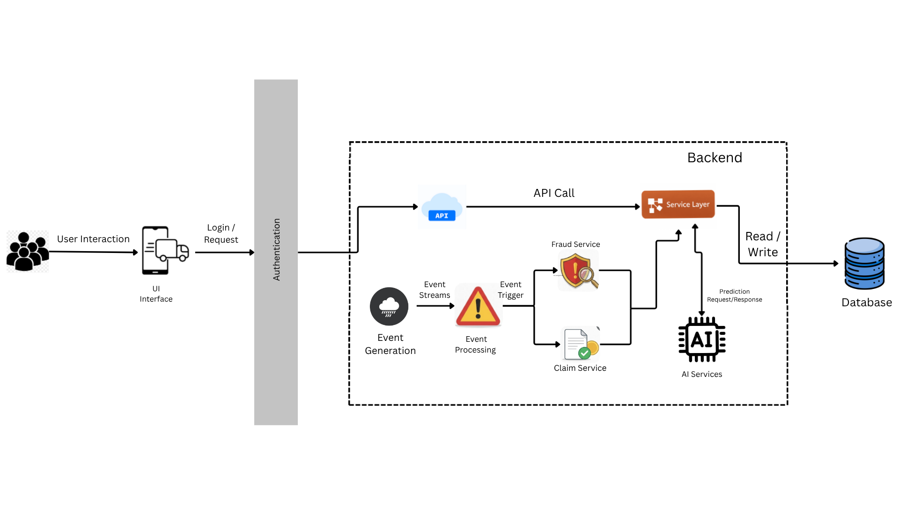

# SteadyRide — Making every ride financially steady

### AI-Powered Parametric Income Insurance for India's Gig Economy

**Persona: Food Delivery Partners (Zomato / Swiggy)**

---

## Table of Contents

1. [Problem Statement](#1-problem-statement)
2. [Persona & Scenarios](#2-persona--scenarios)
3. [Solution Overview](#3-solution-overview)
4. [System Architecture Diagram](#4-system-architecture-diagram)
5. [Parametric Trigger System](#5-parametric-trigger-system)
6. [Fraud Detection](#6-fraud-detection)
7. [Weekly Premium Model](#7-weekly-premium-model)
8. [AI/ML Integration](#8-aiml-integration)
9. [Platform Choice](#9-platform-choice)
10. [Tech Stack](#10-tech-stack)
11. [Adversarial Defense & Anti-Spoofing Strategy](#11-adversarial-defense--anti-spoofing-strategy)

---

## 1. Problem Statement

India's food delivery ecosystem runs on the backs of roughly 10 million gig workers. These partners earn entirely through per-order payments with no fixed salary, no paid leave, no employer-backed safety net. Their income is directly tied to how many hours they can actively work, which makes them acutely vulnerable to any external event that disrupts those hours.

A heavy rain during the dinner rush, severe air pollutionl, platforms outage during peak hours, local curfew blocking an entire delivery zone are common disruptions that directly affect a delivery partner’s ability to work. As a result, they can wipe out 30–50% of a worker’s earnings for the day, leaving them with no form of protection. Existing insurance products available to gig workers like health, life, vehicle do not address this at all. The income loss simply gets absorbed.

---

## 2. Persona & Scenarios

We identified the food delivery segment as our primary persona. Delivery partners on platforms like Zomato and Swiggy in Tier-1 cities typically earn between ₹15,000–25,000 per month, work 8–12 hour shifts, and operate in zones that are highly sensitive to weather conditions, platform reliability, and civic disruptions.

To validate the problem and design an effective trigger system, we mapped four representative scenarios:

**Mr. Rahul — Bangalore, Monsoon Disruption**

Mr. Rahul operates along the Whitefield–Koramangala corridor in Bangalore and typically earns around ₹800 per day. During the monsoon season, heavy rainfall frequently coincides with the 7–10 PM dinner peak. On such days, he is forced to pause operations and wait out the rain, resulting in a loss of approximately ₹350–400 within a few hours. This pattern repeats multiple times each month, with no mechanism in place to recover the lost income.

---

**Mr. Arjun — Hyderabad, Platform Outage**

Mr. Arjun is an experienced delivery partner operating in Hitech City, Hyderabad. During a weekday afternoon, the platform experiences a service outage lasting over an hour during active working time. Despite being available and ready to work, Arjun is unable to accept any orders, resulting in a direct loss of income.

---

**Mr. Karthik — Coimbatore, Demand Volatility**

Mr. Karthik works in Coimbatore, where order volumes are relatively stable but can drop sharply due to localized factors such as unexpected closures, off-peak demand dips, or regional events. On certain days, despite being active for his full shift, he receives significantly fewer orders, leading to a noticeable reduction in earnings.

---

**Mr. Vikram — Delhi, Compound Disruption**

Mr. Vikram operates in Dwarka, Delhi. On a particular evening, air quality levels rise above hazardous limits while a political rally simultaneously restricts access to key delivery routes. These overlapping disruptions significantly reduce his ability to complete orders.

---

## 4. System Architecture Diagram



## 5. Parametric Trigger System

Every trigger in SteadyRide is objective and threshold-based. A disruption either meets the defined conditions or it doesn't, there is no subjective assessment, no claims adjuster, and no waiting period. This is what makes the system scalable, transparent, and tamper-resistant. The triggers fall into three categories: environmental, platform-level, and social or operational.

### Environmental Triggers

Environmental disruptions are conditions that make it physically difficult or dangerous for a delivery partner to ride.

| Trigger         | Threshold                                                                     | Why This Threshold                                                                                                                                                                                                                              |
| --------------- | ----------------------------------------------------------------------------- | ----------------------------------------------------------------------------------------------------------------------------------------------------------------------------------------------------------------------------------------------- |
| Heavy Rainfall  | > 15mm/hr during peak windows (12–2 PM or 7–10 PM)                            | Below this rate, riders can generally continue. At 15mm/hr, two-wheeler traction is compromised and restaurant order volumes drop simultaneously. Restricted to peak windows because rain outside those hours has minimal earnings impact.      |
| Extreme Heat    | Heat index > 45°C for 3+ continuous hours                                     | We use heat index rather than raw temperature because humidity is the operative variable for outdoor workers. 40°C in dry heat and 40°C in humid conditions are not the same experience — only the heat index captures that difference.         |
| Urban Flooding  | Flood probability > 70% based on rainfall + ward-level drainage quality index | Raw rainfall is a poor proxy because drainage infrastructure varies enormously within a single city. The same rainfall that floods one ward may have no impact two kilometres away. The drainage quality index makes the trigger zone-accurate. |
| High Wind       | Sustained wind > 45 km/hr                                                     | The point at which two-wheeler stability is materially compromised for the average rider on urban roads.                                                                                                                                        |
| Lightning Alert | Active IMD lightning advisory in the worker's zone                            | Riding during a lightning advisory is a genuine safety risk. The IMD advisory is the most reliable, publicly verifiable source for this.                                                                                                        |
| Severe AQI      | AQI > 400 for 2+ continuous hours                                             | AQI 400+ is classified as Severe by the CPCB — extended outdoor exposure at this level poses documented health risks. The 2-hour duration filter prevents brief spikes from triggering payouts.                                                 |

### Platform-Level Triggers

This is where SteadyRide is meaningfully differentiated from anything currently available. Platform-level income shocks are among the most frequent disruptions delivery workers face, yet no existing insurance product recognises or addresses them.

| Trigger            | Threshold                                                                                 | Why This Threshold                                                                                                                                                                                                 |
| ------------------ | ----------------------------------------------------------------------------------------- | ------------------------------------------------------------------------------------------------------------------------------------------------------------------------------------------------------------------ |
| App Downtime       | Platform API health check fails for > 30 continuous minutes during active hours           | Brief outages of a few minutes are routine and have minimal earnings impact. 30 minutes during active hours represents a material lost window that a worker cannot recover.                                        |
| Demand Collapse    | Zone-level order volume drops > 50% vs. same window the prior week                        | A 50% drop signals a genuine shock — not normal fluctuation. Using the same window from the prior week controls for time-of-day patterns and day-of-week variation.                                                |
| Incentive Change   | Mid-week bonus reduction > 20% of expected weekly incentive, detected via hourly API diff | Workers plan their week around expected bonuses. A 20%+ reduction mid-week is a measurable income disruption. Hourly API diffs are necessary because platforms do not proactively notify workers of these changes. |
| Cancellation Spike | Restaurant-attributed cancellations > 3x the worker's personal baseline rate              | Each cancellation destroys the time spent riding to a pickup. 3x the personal baseline indicates a systemic issue — not random variation — that is costing the worker real earnings.                               |
| Batching Drop      | Batch order ratio falls below 15% of total session assignments                            | Batching is a primary driver of earnings efficiency. A sharp drop in batch assignment rate signals a platform-side change that directly reduces a worker's earning potential per hour.                             |

### Social & Operational Triggers

| Trigger                        | Threshold                                                                                                                         | Why This Threshold                                                                                                                                                                                                          |
| ------------------------------ | --------------------------------------------------------------------------------------------------------------------------------- | --------------------------------------------------------------------------------------------------------------------------------------------------------------------------------------------------------------------------- |
| Curfew / Zone Restriction      | Government-issued restriction verified via official notification APIs + corroborated by GPS lockout data from workers in the zone | Dual verification prevents false positives from stale or unofficial sources. Both conditions must be met before the trigger fires.                                                                                          |
| Political Rally / Public Event | Traffic paralysis index > 80% in the worker's zone for > 90 minutes, tied to a verified public event                              | The 90-minute duration filters out brief slowdowns. Event linkage ensures we are responding to a genuine operational restriction, not routine congestion that does not warrant a payout.                                    |
| Road Closure                   | Delivery times > 2x the worker's baseline across 3+ consecutive orders on the same route                                          | Rather than relying on external closure notifications — which are often delayed or incomplete — this detects closures empirically through actual delivery behaviour. Three consecutive orders eliminates one-off anomalies. |

## 6. Fraud Detection

Automatic payouts create an obvious fraud surface. Every payout request passes through a 5-layer scoring pipeline before any money moves. The layers run in parallel to minimise latency without compromising coverage, and together output a single Claim Trust Score between 0 and 100.

| Layer                   | What It Checks                                                                                                                                                     | Why It's Necessary                                                                                                                                             |
| ----------------------- | ------------------------------------------------------------------------------------------------------------------------------------------------------------------ | -------------------------------------------------------------------------------------------------------------------------------------------------------------- |
| Location Validation     | GPS coordinates at disruption time cross-referenced against the worker's declared active zone. Anomaly > 2km flags the claim.                                      | Catches the most basic form of abuse — a worker claiming a disruption in a zone they were not operating in.                                                    |
| Activity Validation     | App-open time, order acceptance timestamps, and accelerometer data confirm the worker was actively riding before the disruption, not already idle.                 | A worker who had been stationary before the disruption event has no legitimate earnings loss to recover.                                                       |
| Behavioural Biometrics  | Tap velocity, swipe patterns, and login behaviour compared against the worker's own 30-day personal baseline. Deviation > 2 standard deviations triggers scrutiny. | Effective against account-sharing and bot-assisted claim submission, where interaction patterns diverge noticeably from the account holder's normal behaviour. |
| Order Graph Analysis    | Network graph of worker-restaurant interactions over time. Repeated claim-linked cancellations between the same worker-restaurant pairs flag coordinated fraud.    | Individual-level checks miss collusion. Graph analysis detects patterns across interactions that only become visible when looked at as a network.              |
| Cross-Platform Identity | Aadhaar hash and device fingerprint checked across all SteadyRide accounts.                                                                                        | Prevents multi-account abuse, where the same individual registers multiple worker profiles to multiply payouts from a single disruption event.                 |

The combined score determines the payout path:

| Claim Trust Score | Action                                                                       |
| ----------------- | ---------------------------------------------------------------------------- |
| 70–100            | Instant UPI payout within 90 seconds                                         |
| 40–69             | Deferred payout within 2 hours; soft verification message sent to the worker |
| < 40              | Manual review queue, held up to 24 hours                                     |

Repeated low-trust claims result in account suspension and a permanent fraud flag.

---

## 7. Weekly Premium Model

### Why Weekly

Zomato and Swiggy both operate on weekly settlement cycles, and delivery partners naturally think about their income in weekly terms — what they earned this week, what they expect next week. A monthly premium creates cash flow friction that doesn't match this reality. A weekly premium in the ₹20–80 range is proportional, predictable, and fits naturally into the settlement cadence workers already operate on.

### Premium Calculation

```
Weekly Premium = Base Rate × Earnings Multiplier × Zone Risk Factor × Forecast Index × Behavioural Discount
```

| Variable             | What It Captures                                                           | Why It's in the Formula                                                                                                                                                                                                                         |
| -------------------- | -------------------------------------------------------------------------- | ----------------------------------------------------------------------------------------------------------------------------------------------------------------------------------------------------------------------------------------------- |
| Base Rate            | Floor premium for the selected coverage tier                               | Sets the minimum cost of coverage before any personalisation. Anchors the premium to the level of protection the worker has chosen.                                                                                                             |
| Earnings Multiplier  | Scales to the worker's actual weekly earning level                         | A worker earning ₹1,200/day has more at stake than one earning ₹600/day. The premium should reflect the higher expected payout exposure — not apply a flat fee that underprices high earners or prices out low earners.                         |
| Zone Risk Factor     | Historical disruption frequency and severity in the worker's primary zones | Two workers with identical earnings can carry very different risk profiles depending on where they operate. A flood-prone ward in Chennai is structurally riskier than a well-drained zone in Pune.                                             |
| Forecast Index       | Upcoming weather, AQI, and civic risk signals for the coming week          | Premiums should be forward-looking, not purely backward-looking. If a weather system is incoming or a large civic event is confirmed, the expected payout exposure for that week is higher.                                                     |
| Behavioural Discount | Worker's activity patterns, zone adaptability, and claims history          | Workers who consistently demonstrate lower actual risk — staying active through mild disruptions, switching zones proactively, maintaining clean claims history — should pay less. This rewards good behaviour and keeps the risk pool healthy. |

---

## 8. AI/ML Integration

### Models

**Disruption Probability Scorer — XGBoost**
Runs every 5 minutes per worker-zone pair. Trained on historical weather, AQI, traffic, platform event, and earnings data. Outputs a 0–100 disruption probability score that feeds directly into the trigger engine.

**Income Loss Estimator — LSTM**
Predicts what a worker should have earned in any given time window based on their historical patterns. The delta between predicted and actual earnings during a confirmed disruption forms the payout basis. This is more accurate than a flat payout table because it reflects each worker's individual earning capacity, not a city-wide average.

**Dynamic Premium Calculator — Random Forest + Logistic Regression**
Computes the expected payout value across all trigger types for the upcoming week, then adjusts for behavioural factors and fraud risk history to arrive at the final premium.

**Fraud Detection — Isolation Forest + Autoencoder**
Flags anomalous claim patterns in real time. Outputs the Claim Trust Score described in Section 6 for every payout request.

**Zone Risk Heatmap — DBSCAN Clustering**
Clusters historical disruption data alongside civic infrastructure quality data — drainage index, road quality, lighting levels — to produce a live risk heatmap at 1km² granularity per city.

### Weekly Premium Computation — Step by Step

Every Sunday at 6 PM, the premium engine runs the following process for each active worker:

1. Pull the past 4 weeks of earnings, zone activity, claims, and behavioural data
2. Fetch the 7-day forecast for the worker's primary zones — weather, AQI, traffic, civic events
3. Run the Income Loss Estimator to generate a disruption probability distribution across all trigger types
4. Compute expected payout value as the sum of (disruption probability × estimated income loss) across all triggers
5. Apply risk margin (1.25×), behavioural discount, and zone factor to arrive at the final premium
6. Push a notification to the worker on Monday morning with their premium and a one-tap renewal option

### Additional AI Features

**Earnings Forecasting** — Workers can view a 7-day earnings outlook for their zones, based on upcoming weather, civic, and platform signals. This helps them plan shifts proactively rather than reacting to disruptions after the fact.

**AI Coaching** — Personalised recommendations surfaced in the app: shift timing suggestions, zone alternatives, and advance alerts when the next day looks high-risk. Reducing actual disruption exposure over time benefits both the worker and the broader risk pool.

---

## 9. Platform Choice

### Mobile over Web

SteadyRide is built as a mobile-first application. This is not a default choice — it follows directly from who the users are and how they work.

Delivery partners operate entirely on the move. Their phone is their primary work tool: they receive orders on it, navigate with it, communicate through it, and track their earnings on it. At no point in a working day are they seated at a computer. A web application optimised for desktop would simply not be accessible in the moments that matter — a disruption event during a shift, a payout notification mid-ride, or a quick premium renewal on a Sunday evening. The product had to be on the device the worker already has in their hand.

Beyond accessibility, the mobile form factor is a functional requirement for several core features. Real-time fraud detection relies on GPS coordinates, accelerometer data, and behavioural biometrics — signals that are only available on a smartphone. Zone risk monitoring and payout alerts require push notifications. None of these are reliably available on a desktop browser.

### Progressive Web App over Native Android

Within the mobile decision, we chose a Progressive Web App rather than a native Android application.

The primary reason is distribution. Our target users are gig workers, many of whom are cautious about installing unfamiliar apps from the Play Store — particularly apps that request location access and link to their earnings accounts. A PWA is accessed via a URL and installs to the home screen with a single prompt. There is no app store approval gate, no 50MB download, and no storage anxiety. The entire installed footprint is under 5MB.

A PWA also gives us everything the product needs technically. The Web APIs available today support GPS access, push notifications, background sync, accelerometer data, and offline functionality via service workers — covering every capability required for disruption monitoring, fraud detection, and payout delivery. Native Android would offer marginal additional capability at significantly higher development and maintenance cost.

Offline support via service workers is particularly relevant for workers operating in low-connectivity urban fringe zones, where network reliability is inconsistent. The app continues to log activity and queue data locally, syncing when connectivity is restored.

Finally, a PWA simplifies our ability to support vernacular interfaces. Hindi, Tamil, Telugu, Kannada, and Bengali can be served through a single codebase with standard internationalisation tooling, without the overhead of managing separate native builds or Play Store listings per language variant.

---

## 10. Tech Stack

| Layer             | Technology                                                                                               |
| ----------------- | -------------------------------------------------------------------------------------------------------- |
| Frontend          | React + TypeScript, Tailwind CSS, Vite, Workbox (offline / service worker)                               |
| Backend           | FastAPI (Python) — premium calculation, trigger engine, payout orchestration                             |
| Stream Processing | Apache Kafka + Apache Flink — real-time signal ingestion and disruption scoring                          |
| ML                | XGBoost, LSTM via TensorFlow/Keras, Isolation Forest, DBSCAN — tracked and served via MLflow             |
| Databases         | PostgreSQL (transactional), Redis (real-time state cache), TimescaleDB (time-series weather/AQI/traffic) |
| Geospatial        | Mapbox GL JS (heatmaps), PostGIS (spatial queries), Google Maps Platform (routing, traffic)              |
| External APIs     | IMD Weather API, CPCB AQI API, HERE Traffic API, Zomato/Swiggy Partner APIs (simulated for demo)         |
| Payments          | Razorpay UPI AutoPay                                                                                     |
| Auth & Identity   | Aadhaar OTP via DigiLocker API, Firebase Auth, JWT                                                       |
| Infrastructure    | AWS EKS, CloudFront CDN, S3 (model artifacts), Terraform                                                 |

---

## 11. Adversarial Defense & Anti-Spoofing Strategy

### The Threat

A coordinated syndicate of 500 delivery workers, organised via Telegram, used GPS-spoofing applications to fake their locations inside a verified severe weather zone. While resting at home, they triggered mass parametric payouts, draining the liquidity pool before any detection mechanism fired. The attack exploited a single point of trust: the system believed GPS, and GPS alone.

This is not a fringe scenario. Parametric systems that pay automatically are high-value fraud targets precisely because of the speed that makes them useful. The defense cannot be a single patch. It has to be layered, with each layer catching what the one before it misses.

### 1. Differentiating a Genuine Worker from a Spoofer

The core challenge is that a spoofed GPS coordinate and a real one look identical in isolation. Differentiation requires triangulating across signals that are significantly harder to fake simultaneously.

**Multi-source location verification** is the first line. SteadyRide never trusts GPS in isolation. Every location claim is cross-verified against cell tower triangulation, WiFi network positioning, and IP geolocation. A genuine worker caught in heavy rain will show consistent signals across all three sources — their cell tower, nearby WiFi networks, and IP will all place them in the same area. A bad actor spoofing GPS from home will show a GPS coordinate that disagrees with their actual cell tower and WiFi environment. Any meaningful discrepancy between these sources immediately flags the claim.

**Anti-spoofing detection** runs at the device level. Android's mock location flag — enabled through developer options and required by most GPS spoofing apps — is checked at claim time. Root detection and emulator checks run alongside it. Critically, accelerometer and gyroscope data are compared against the claimed movement state. A worker claiming to be stranded mid-route shows a device that has been moving. A worker sitting at home shows a stationary device. Spoofing GPS coordinates does not spoof the IMU, and that gap is detectable.

**Behavioural anomaly detection** adds the ML layer. Impossible movement patterns — a device that was in Koramangala 3 minutes ago and is now in Whitefield, or multiple workers simultaneously claiming from coordinates within metres of each other — are flagged by the anomaly scorer. The system also tracks whether the worker was active and moving _before_ the disruption event. A worker who was stationary for 40 minutes before the trigger fired has a materially different profile from one who was mid-delivery.

### 2. Data Points Used to Detect a Coordinated Fraud Ring

Individual-level signals catch individual bad actors. Coordinated rings require network-level analysis.

| Signal                                | What It Reveals                                                                                                                                                                                                           |
| ------------------------------------- | ------------------------------------------------------------------------------------------------------------------------------------------------------------------------------------------------------------------------- |
| Claim timing clusters                 | Multiple workers filing claims within a narrow time window from the same zone is a statistical anomaly in normal operations. A coordinated Telegram group produces a visible spike.                                       |
| Coordinate proximity                  | Genuine workers spread across a disrupted zone. Spoofing rings tend to cluster at or near identical coordinates — the same fake GPS point shared in a group chat.                                                         |
| Device fingerprint overlap            | Shared device identifiers, identical hardware profiles, or the same SIM-linked Aadhaar hash across multiple accounts signals multi-account abuse from the same physical device.                                           |
| Network graph of claim-linked workers | A graph of which workers filed claims at the same time, in the same zone, with overlapping restaurant interaction histories surfaces the structure of a coordinated group even when individual claims look clean.         |
| Velocity of claim submission          | A genuine disruption produces a gradual claim ramp as workers encounter conditions and file individually. A coordinated ring produces a near-simultaneous spike. The submission velocity curve is a strong discriminator. |
| Pre-event activity consistency        | The system checks whether each claimant was actively working in the declared zone in the 30–60 minutes before the trigger fired. Workers fabricating presence have no prior activity trace in that zone.                  |

When a coordinated spike is detected, the circuit breaker activates. All claims from the flagged cluster are moved to a holding queue pending review, and the payout engine rate-limits further submissions from the same zone until the anomaly is resolved. The liquidity pool is protected from a mass drain event while genuine claims from unaffected workers in other zones continue to process normally.

### 3. Handling Flagged Claims Without Penalising Honest Workers

This is the design tension that most fraud systems get wrong. Aggressive fraud detection that delays or blocks legitimate claims destroys trust with the exact workers the platform exists to serve. A delivery partner caught in a genuine storm, whose network is degraded, whose GPS is momentarily inconsistent because of signal interference, should not be penalised for looking like a fraud signal.

SteadyRide handles this through a tiered payout structure rather than a binary approve/reject gate.

When a claim is flagged — whether for location inconsistency, timing anomaly, or group correlation — it does not result in a denial. Instead:

- A partial advance of 15–20% of the estimated payout is released immediately. This gives a genuine worker meaningful liquidity while the verification runs, without releasing the full payout to a potential bad actor.
- A short verification step is triggered: a passive one (cross-checking additional sensor data and activity history automatically) for borderline cases, and a lightweight active one (a brief in-app confirmation with a photo or location re-check) for higher-risk flags.
- The remaining payout clears within 2 hours once verification passes. For workers with a strong historical trust score, the bar for the secondary check is lower — the system extends greater benefit of the doubt to workers it knows.

Honest workers who are genuinely stranded in bad weather will typically pass verification quickly. The network degradation scenario is handled by grace-period logic: if a worker's GPS consistency drops during a confirmed high-severity weather event — which is a known phenomenon in heavy rain — the system weights other signals (prior zone activity, accelerometer state, platform activity log) more heavily rather than failing the claim on GPS inconsistency alone.

The goal is simple: pay honest workers fast, and make it expensive for bad actors to exploit the system without destroying the experience for everyone else.

### Defense Architecture Summary

| Layer                                 | Threat It Addresses                                  |
| ------------------------------------- | ---------------------------------------------------- |
| Multi-source location verification    | GPS spoofing via fake coordinates                    |
| Device-level spoof detection          | Mock location apps, emulators, rooted devices        |
| Accelerometer / IMU consistency check | Stationary device claiming active movement           |
| Behavioural anomaly scoring           | Impossible movement, pre-event inactivity            |
| Claim timing velocity analysis        | Coordinated simultaneous submission spikes           |
| Coordinate proximity clustering       | Multiple workers claiming from identical GPS points  |
| Device fingerprint + Aadhaar binding  | Multi-account abuse from a single individual         |
| Network graph fraud ring detection    | Coordinated groups invisible at the individual level |
| Tiered partial payout                 | Mass liquidity drain before detection                |
| Circuit breaker + zone rate limiting  | Cluster-scale drain during an active attack          |
| Pre-event activity trace validation   | Fabricated presence in a disruption zone             |

---

_SteadyRide — built for India's gig economy, designed around the worker._
